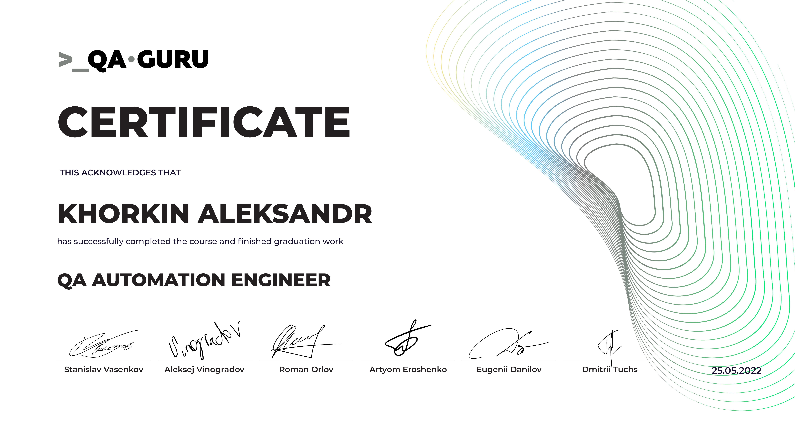

<h1 align="center">Hi, everyone 🤠, my name is Aleksander and welcome to my Github Page!
<!-- Typing SVG by DenverCoder1 - https://github.com/DenverCoder1/readme-typing-svg -->

  

<!-- Education section -->

	
  
👨‍🎓 Education 👨‍🎓

<tr>
    <td width="30%" valign="center">
        </td>
        <td valign="middle">𝒮𝒸𝒽𝑜𝑜𝓁 𝑜𝒻 𝒜𝓊𝓉𝑜𝓂𝒶𝓉𝒾𝑜𝓃 𝒯𝑒𝓈𝓉𝒾𝓃𝑔 𝐸𝓃𝑔𝒾𝓃𝑒𝑒𝓇𝓈 
             <a target="_blank" href="https://qa.guru">QA.GURU</a>  
        </td>
        
    </tr>
</tr>
</table>
 
  

